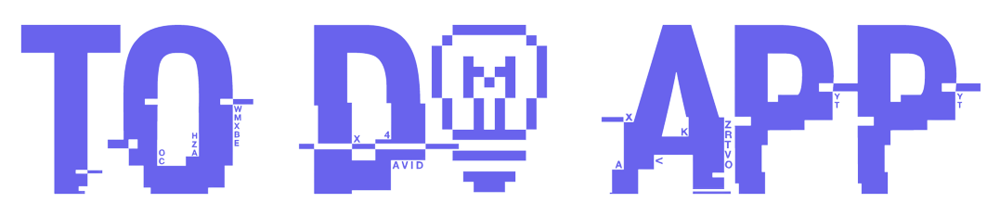
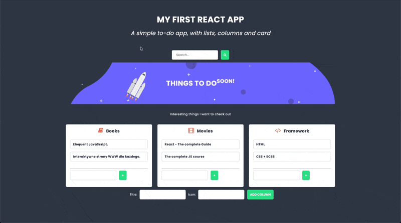

<a id="readme-top"></a>

<p align="center">
  <br>
 </a>
</p>

<h4 align="center">To Do App created as part of the Kodilla Bootcamp project. <br /> Website was developed using React component class definition <br /> and Redux state container.

<br/>

<p align="center">
  <a href="#demo">Demo</a> •
  <a href="#overview">Quick overview</a> •
  <a href="#how-to-use">How To Use</a> •
  <a href="#contact">Contact</a>
</p>

<br />

<p align="center">
  
<p>

## 💻 <a id="demo">Demo :</a>

If you want check To Do App, it is deployed on Netlify. Just click link below :
<br />

https://neon-chimera-01bacc.netlify.app

<p align="right">(<a href="#readme-top">back to top</a>)</p>

## 🚀 <a id="overview">Quick overview :</a>

The To Do App is single-page application developed using React component class definition and Redux state container. The application allows you to add a new column. You can personalize the column name and icon. The icon is taken from the free icon library Font Awesome. In each column, you can create new tabs with any name. The search engine allows you to filter cards by name.

<p align="right">(<a  href="#readme-top">back to top</a>)</p>

## 💾 <a id="how-to-use">How To Use :</a>

```bash
# Clone this repository
$ git clone https://github.com/iMdPd/emberToDoApp.git

# Go into the repository
$ cd random/directory/reactToDoApp

# Install dependencies
$ yarn install

# Run the app
$ yarn start
```

<p align="right">(<a href="#readme-top">back to top</a>)</p>

## 🤙🏻 <a id="contact">Contact :</a>

> GitHub [@iMdPd](https://github.com/iMdPd)
